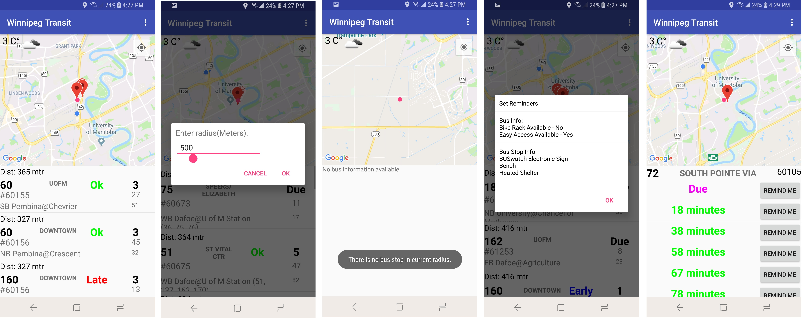

# TransitApplication

A Winnipeg Transit Android application providing live transit and weather information to aid with commute scheduling and planning.

## To Build apk:
1. Clone repo
2. Download and install missing SDK's, packages
3. Build app

Note: App requires location to be turned on for maps.

## Or use pre-build application:
In main directory of this repo, download WinnipegTransitGo.apk and install on android.

## Screenshots:

